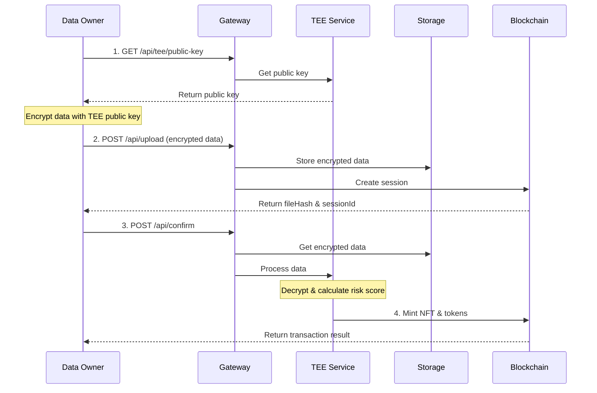
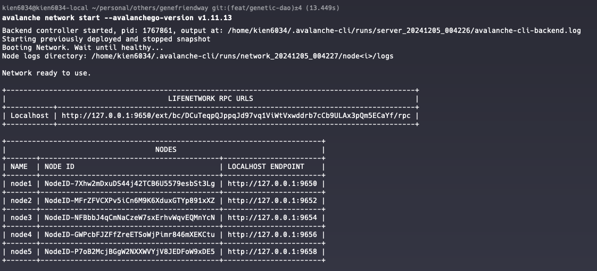
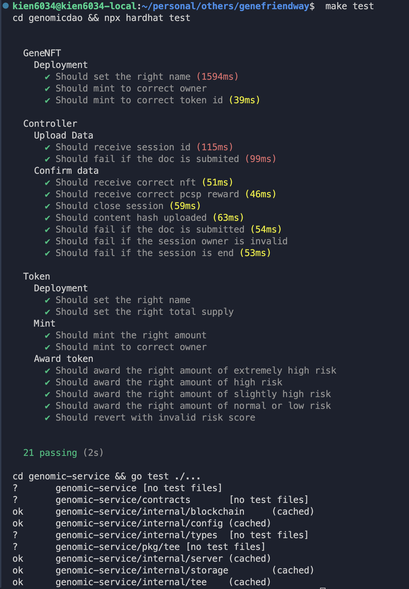

# GenomicDAO Implementation Submission


## Overview
Project contains a genomic data processing platform using Avalanche Subnet, Trusted Execution Environment (TEE), and smart contracts. 

 - [x] Avalanche Subnet Setup
 - [x] Smart Contracts testing passes
 - [x] Backend service to interact with blockchain
 - [x] Testing for all components (contracts & backend)


## Flow Diagram


## Implementation Details
### 1. Avalanche Subnet Setup
- To setup Avalanche Subnet, run `make run-subnet`
- To clean up, run `make clean-subnet`

Subnet setup should looks like this:


### 2. Smart Contracts

- Contracts are updated and tests pass `npx hardhat test`
- Add script to deploy contracts `make deploy-contract`

Output should looks like this: 
```
./scripts/deploy-contract.sh
Deploying contracts with account: 0x8db97C7cEcE249c2b98bDC0226Cc4C2A57BF52FC
GeneNFT deployed to: 0x3f772F690AbBBb1F7122eAd83962D7919BFdD729
PCSP Token deployed to: 0x3c4A9b7353e37f57a91fB183d1C03032964f79F0
Controller deployed to: 0x07FA28605071208CCFbB87AD136A347a9d034BFf
Ownership transferred to Controller

Contract Addresses:
-------------------
GeneNFT: 0x3f772F690AbBBb1F7122eAd83962D7919BFdD729
PCSP Token: 0x3c4A9b7353e37f57a91fB183d1C03032964f79F0
Controller: 0x07FA28605071208CCFbB87AD136A347a9d034BFf
```
- Add script to generate go artifacts `make generate-artifacts`
  - This should generate the `genomic-service/contracts` folder with the go bindings for the contracts

### 3. Backend Service Architecture
Details for the backend service can be found in [genomic-service/README.md](genomic-service/README.md)

Developed following components:
- API Server: REST API to interact with client using `gin-gonic` framework
- Blockchain Service: Client to interact with blockchain to submit data and mint NFTs
- Storage: Mock storage, used in-memory storage for simplicity
- TEE Service: Setup TEE service to decrypt encrypted data and calculate risk score
- Config: Configuration for the settings and secrets
- SDK: SDK for data provider to encrypt and submit data
- Tests: Comprehensive test coverage for all components

### 4. Testing

#### Pre-requisites
- Make sure to run `make run-subnet` to setup the subnet

- Make sure to run `make deploy-contract` to deploy the contracts
- Make sure to update the corresponding contract addresses and RPC endpoint in the `genomic-service/internal/config/app.ini` file

#### Running tests
- To run tests, run `make test`
- This should run the tests for both contracts and backend service
  - Tests for contracts should pass
  - Each package contains its own tests 
  - Main flow is tested in `Test_Main` function in `genomic-service/internal/server/server_test.go`

