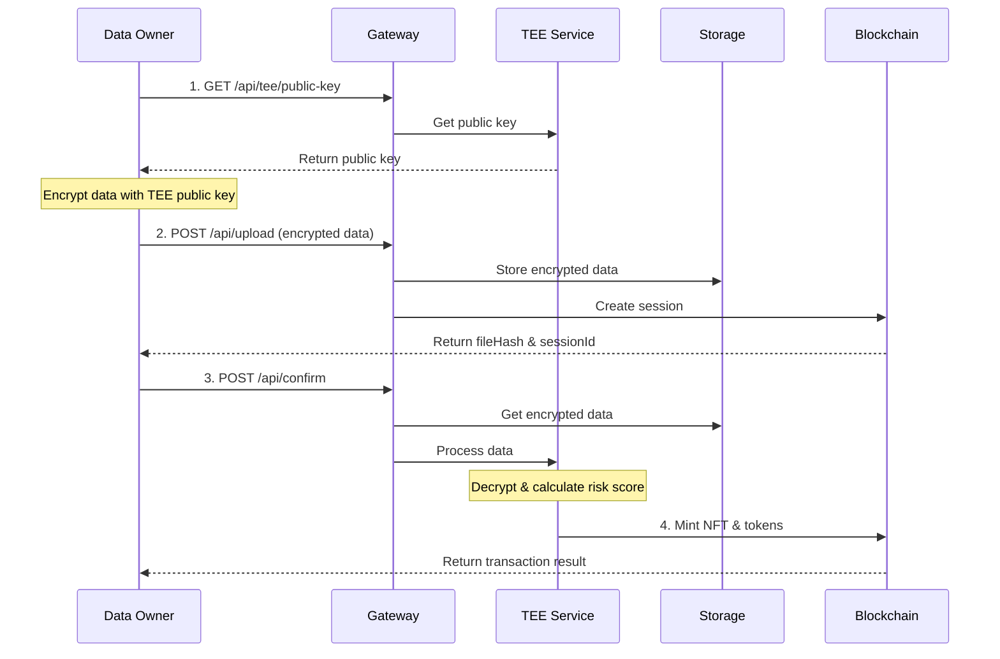

# Genomic Service

A service that enables secure genomic data processing using Trusted Execution Environment (TEE) and blockchain technology.


## Flow Diagram


## Components
### Internal
- [server](./internal/server):
    - REST API to interact with client using `gin-gonic` framework

- [config](./internal/config):
    - Configuration for the settings and secrets

- [tee](./internal/tee)
    - Handles decryption of genomic data
    - Calculates risk score

- [storage](./internal/storage):
    - Stores encrypted genomic data
    
- [blockchain](./internal/blockchain):
    - Handles smart contract interactions
    - Mints NFTs
    - Distributes PCSP tokens

### Pkg
- [tee](./pkg/tee):
    - SDK for user to encrypt their data

## Architecture Flow

1. **Data Owner Initialization**
   - Data owner requests TEE's public key from service
   - Endpoint: `GET /api/tee/public-key`
   - Used for encrypting sensitive genomic data

2. **Data Upload Process**
   - Data owner encrypts genomic data using TEE's public key
   - Uploads encrypted data to service
   - Endpoint: `POST /api/upload`
   - Returns:
     - `fileHash`: Unique identifier for stored data
     - `sessionId`: Blockchain session identifier

3. **Data Processing in TEE**
   - Data owner initiates processing with `fileHash` and `sessionId`
   - Endpoint: `POST /api/confirm`
   - TEE:
     - Decrypts data using private key
     - Calculates risk score (1-4):
       - 4: Extremely high risk (15,000 PCSP tokens)
       - 3: High risk (3,000 PCSP tokens)
       - 2: Slightly high risk (225 PCSP tokens)
       - 1: Low risk (30 PCSP tokens)

4. **Blockchain Integration**
   - Service mints NFT representing genomic data
   - Awards PCSP tokens based on risk score
   - Records transaction on GenomicDAO Network


## Security Features

- Data always encrypted outside TEE
- Private key never leaves TEE
- Blockchain ensures immutable record
- Zero-knowledge of genomic data outside TEE

## Testing
Run the test suite:
```
go test ./...
```
